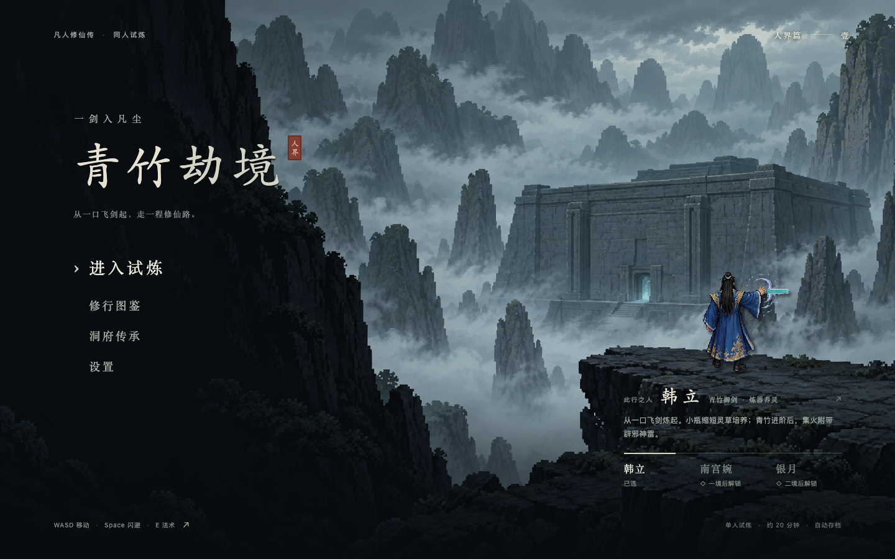
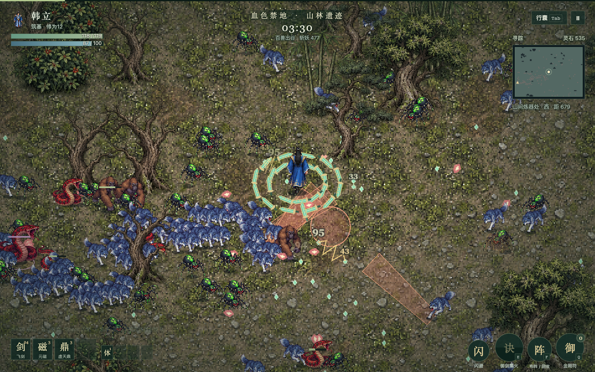
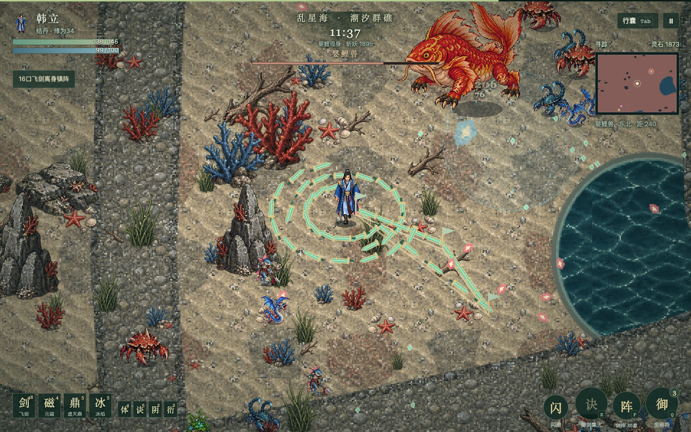
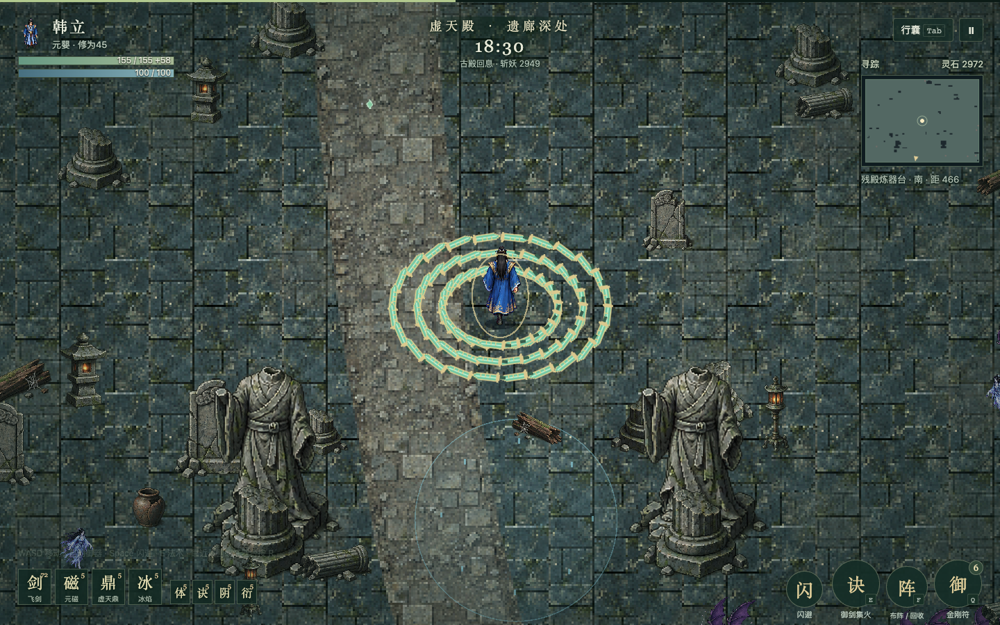
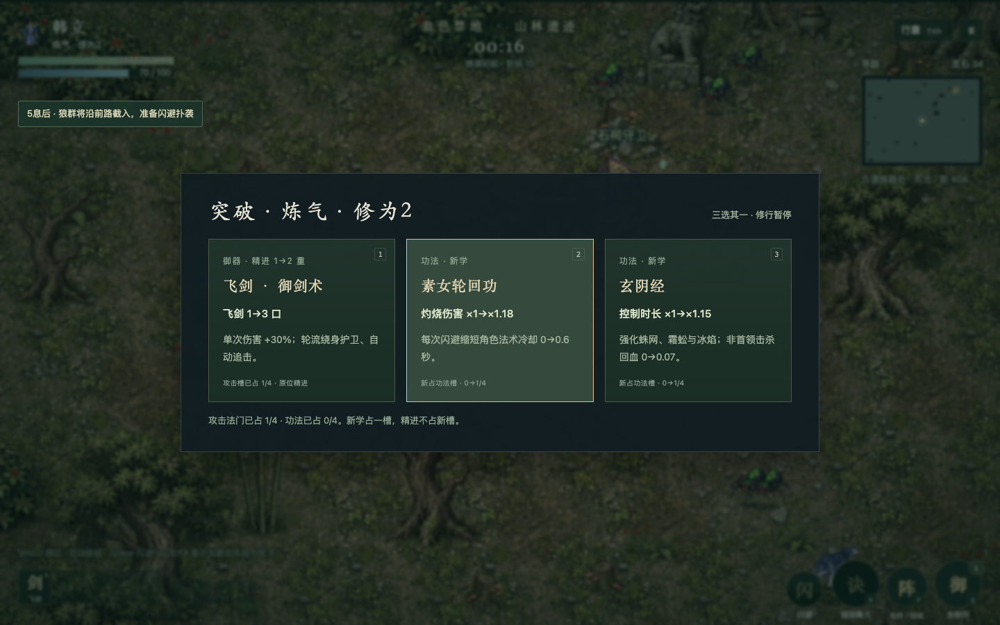
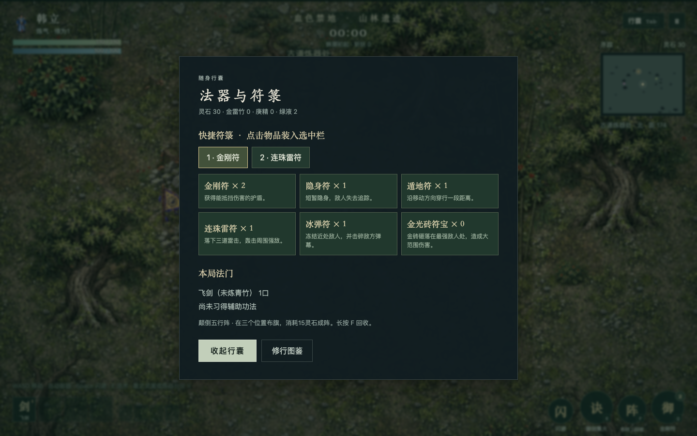

# 青竹劫境 · 人界试炼

一个取材于《凡人修仙传》的非官方同人像素生存游戏。使用 AI 辅助开发，目前是可玩的早期版本，欢迎试玩、反馈问题和一起开发。



公开试玩见 [原入口](https://qingzhu-jiejing.amajobs.chatgpt.site)；备用入口由本仓库 GitHub Pages 发布。不同域名的存档分别保存。

## 怎么玩

控制角色走位，法器自动攻击。拾取灵气后升级，选择法术与功法，探索材料点并炼制法宝，也能放置阵旗组成阵法。

- 从韩立开始，通过前两境分别解锁南宫婉、银月。
- 血色禁地、乱星海、虚天殿三境。每境满 60 秒可提前挑战首领，击败后可立即离境。
- 十二种攻击法门，每局最多携带四件攻击法门和四门功法。
- 飞剑从一口逐步成长到七十二口，金雷竹、庚精与境界共同决定进阶。
- 地图随探索延伸，包含道路、障碍、采集点和十八类场景主题。
- 狼群扑击、毒弹和妖猿冲锋需要走位；首领招式有预警与恢复窗口。
- 自动保存当前进度，支持刷新后继续。手机请横屏游玩，地图持续显示目标、距离与下一步提示。

## 本地运行

需要 Node.js 22 或更高版本。

```sh
git clone https://github.com/Amadeus-ddc/qingzhu-jiejing.git
cd qingzhu-jiejing
npm ci
npm run build
npm start
```

打开 [本地游戏](http://127.0.0.1:4174/)。每次修改源码后重新运行 `npm run build`。`dist/` 是可部署到静态网站服务的构建产物。

## 操作

| 操作 | 键位 |
| --- | --- |
| 移动 | WASD / 方向键 |
| 闪避 | Space |
| 角色法术 | E |
| 放置阵旗 / 长按回收 | F |
| 与附近地点交互 | R |
| 使用符箓 | Q |
| 切换符箓快捷栏 | 1 / 2 |
| 行囊 | Tab |
| 暂停 | P / Esc |

手机横屏使用左侧摇杆和右侧按钮。

## 参与开发与反馈

欢迎直接提 [Issue](https://github.com/Amadeus-ddc/qingzhu-jiejing/issues)，或者 Fork 后提交 Pull Request。法宝与阵法设计、敌潮节奏、像素美术、操作手感和性能问题都可以讨论。

报告问题时，附上使用的设备与浏览器、所在关卡，以及问题出现前的操作；有截图会更容易复现。也欢迎直接说哪一段无聊、哪种法宝不好用、下一版想玩到什么。

## 开发与验证

- `src2d/` 是当前游戏源码，`assets/pixel/` 是运行时美术。
- `npm test` 检查战斗、地形、寻路和敌潮规则。
- `npm run test:balance` 运行六组确定性模拟，不等同于真人试玩。
- `node tests/pixel-browser.mjs` 通过键盘和界面进行浏览器验证，需要本机 Chrome 与已启动的本地服务。
- 既有验证覆盖40项规则检查，以及一次约22分钟的完整浏览器通关。最终首领调整另做专项验证，不能据此保证所有构筑都平衡。

## 实机画面







## 题材与来源

这是非官方同人项目，与原作及动画权利方没有关联。角色与世界观取材于《凡人修仙传》，玩法安排属于改编；美术使用 AI 辅助生成。章节依据与改编边界见 [三境场景依据](SOURCES_WORLD.md)。第三方依赖遵循各自许可证。

## 玩家反馈修订

本次降低开局压力、逐段增强敌潮耐久、改善贴障碍步行，并增加提前挑战首领与横屏目标引导。详见 [修订与验证记录](tests/PLAYER_FEEDBACK_VALIDATION.md)。
